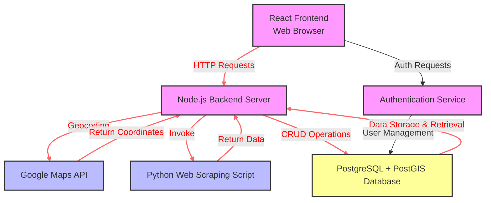

[](https://badge.fury.io/js/npm)
[](https://github.com/prettier/prettier)
# GIS-WebScraper

> An app that allows a user to enter a US state name, and a keyword for businesses in that state, e.g "California". Then the app loads google maps with grids (~25mile radius area) overlayed over the given state. Clicking on any of the grids calls the web scraper which returns all the keyword businesses in that grid with the given state.

## Table of contents

- [GIS-Webscraper](#project-name)
    * [Table of contents](#table-of-contents)
    * [Application Architecture](#application-architecture)
    * [Prerequisites](#prerequisites)
    * [Node backend](#node-backend)
        + [Search API Endpoint](#search-api-endpoint)
        + [Grid generation API](#grid-generation-api)
        + [Webscraper API](#webscraper-api)
        + [Web scraping logic](#web-scraping-logic)
    * [Frontend](#frontend)
    * [Data management](#data-management)
    * [TO-DO](#to-do)
        + [Auth Architecture](#auth-architecture)

## Application Architecture

                        +-------------------+
                        |   Web Browser     |
                        | (React Frontend)  |
                        +---------+---------+
                                  |
                                  | HTTP Requests (e.g., REST API)
                                  |
                        +---------v---------+
                        |   Node.js Server  |----------------------+
                        |   (Backend)       |                      |
                        +---------+---------+                      |
                                  |                                |
                +-----------------+---------------------+          |
                |                 |                     |          |
                |                 | HTTP Requests       |          |
                |                 |                     |          |
    +-----------v-------+    +----v-----------------+   |    +-----v-------+
    |  PostgreSQL DB    |    |  External APIs       |   |    | Python      |
    |  + PostGIS        |    |  (e.g., Google Maps) |<--+    | Web Scraping|
    +-------------------+    +----------------------+        | Script      |
          |                                                  +-------------+
          |
          | Data Retrieval & Storage
          |
    +-----v------+
    | Data       |
    | Analysis & |
    | Reporting  |
    +------------+

## Prerequisites

This app requires:
- `NodeJS`
- `Python` (with Selenium)
- `ReactJS`
- `PostgreSQL` (with PostGIS)
- `Typescript`
- `Google maps API KEY`

## Node Backend

A Node.js server that handles API requests, interacts with external services like the Google Maps API, performs web scraping, and communicates with the PostGIS-enabled PostgreSQL database.

### Search API Endpoint

Given a state, keyword, city(optional), and country (optional and defaults to U.S), this endpoint will return the bounding coordinates from the center of the given location upto a 25mi radius. For more accurate results, it is recommended to pass in the optional city

*NB: REQUIRES GOOGLE MAPS API KEY. SET IT IN THE .env FILE AS `GOOGLE_MAPS_API_KEY=your-goole-maps-key`*

### Grid generation API

- Determines State Boundaries: Uses PostGIS and data from the US Consensus  
(/GeoWebScrapper/backend/tl_2023_us_state.zip) to determine the geographical boundaries of a given state using the northernmost, southernmost, easternmost, and westernmost points.

Shapes used can be found [here](https://www.census.gov/geographies/mapping-files/time-series/geo/tiger-line-file.2023.html#list-tab-790442341)

```
import shape files
`shp2pgsql -s [SRID] -I -D -W [encoding] myfile.shp mytable | psql -U [username] -d mydb` [source](https://mapscaping.com/loading-spatial-data-into-postgis/#:~:text=One%20common%20way%20to%20load,load%20a%20shapefile%20called%20%E2%80%9Cmyfile.)
`shp2pgsql -s 4326 -I -D -W "UTF-8" your_shapefile.shp state-shapes | psql -U your_username -d your_database`
```
- Calculates Grid Sizes: Given that each grid cell aims to represent an area equivalent to a circle with a 25-mile radius,this endpoint calculates the dimensions of each grid cell. 
Since the area of a circle is πr², and we want each grid cell to have an equivalent area, the side length of each square grid cell would be sqrt(πr²). For a 25-mile radius, this would be approximately sqrt(π*25²) ≈ 28 miles.

- Creates the Grid: Starting from the westernmost point, vertical grid lines at intervals equal to the grid cell size are created until the easternmost boundary of the state is reached. Then, starting from the southernmost point, horizontal grid lines are created at the same intervals until the northernmost boundary is reached. Each intersection of horizontal and vertical lines defines a grid cell. Returns the bounding coordinates (latitude and longitude of the four corners) of the grid cell.

*Since the Earth is not flat, the distance represented by a degree of latitude is fairly constant, but the distance represented by a degree of longitude varies with latitude. It might be necessary to adjust the width of the grid cells based on their latitude to keep the area of the cells consistent. A common approach is to calculate the grid cell width in longitude degrees at the equator and then adjust this width as you move north or south to account for the change in the Earth's circumference.*

### Webscraper API

Given grid coordinates in a given state, this endpoint runs the Python webscraper script and returns a list of results for businesses that match the given keyword.

### Web scraping logic

- Uses `Selenium` in Python to search Google Maps for the specified keyword within the given grid in a given state.
- Extracts the necessary details from the search results, such as business names, websites, phone numbers, emails, and verification status.

 NB: 
1. Ensure scraper respects robots.txt files and Google's Terms of Service to avoid legal issues or being blocked by Google.
2. Rate Limiting and IP Blocking: Be mindful of Google's rate limiting. Implement delays between requests and consider rotating IP addresses if necessary.

## Frontend

 A user interface built with React that allows users to input a geographic location and a keyword, and displays search results.

 *NB: REQUIRES GOOGLE MAPS API KEY. SET IT IN THE .env FILE AS `REACT_APP_GOOGLE_MAPS_API_KEY=your-goole-maps-key` FOR GRID-BASED SCRAPING OR ENTER IT ON THE UI FORM*

- A form is used to collect the `state name` , `city name`, and a `business keyword` from the user. Optionally, also, collects a `Google Maps API key` if the user choose grid based scraping
- Once the required data is collected, google maps is loaded with grids overlaying the given state.
- Clicking on a grid triggers the web scraper API and returns a list of the business results.

## Data Management

- Uses a PostgreSQL database with the PostGIS extension, designed to store and query geospatial data alongside other business information.
- Extracted data is stored in a PostgreSQL DB with a well-defined schema that includes fields for all the information being collecting, plus geographic coordinates and search keywords for future queries or analytics.

More references
https://postgis.net/docs/ST_Intersects.html

## TO-DO

[ ] Add Typescript

[ ] Implement error handling and logging to manage and debug issues that arise during scraping.

[ ] Consider setting up a cron job or a similar scheduling mechanism to run the scraping tasks at regular intervals.

[ ] Explore additional features, such as user accounts, saved searches, notifications for new or updated listings, etc.

[ ] Handle edge cases: Near the boundaries of the state, some grid cells partially lie outside the state's borders. Depending on the requirements, it might be necessary to handle these cells differently, such as by clipping them to the state boundary or by excluding them altogether if they fall mostly outside the state.

[ ] Add authentication

### Auth Architecture


                                +-------------------+
                                |   Web Browser     |
                                | (React Frontend)  |
                                +---------+---------+
                                          |
                                          | HTTP Requests
                                          |
                               +----------v---------+
                               | Node.js Backend    |
                               |      Server        |
        +----------------------+--------------------+---------------------+
        |                      |                    |                     |
    HTTP Requests          Invoke |           CRUD Operations         Auth Requests
        |                      |                    |                     |
        |                      |                    |                     |
        |                      |                    |                     |
    +---v-------+      +-------v-------+    +-------v------+       +------v------+
    |Google Maps|      |Python Scraping|    |PostgreSQL +  |       |Authentication|
    |    API    |      |     Script    |    |   PostGIS    |       |   Service    |
    +-----------+      +---------------+    |   Database   |       +--------------+
                                            +--------------+





